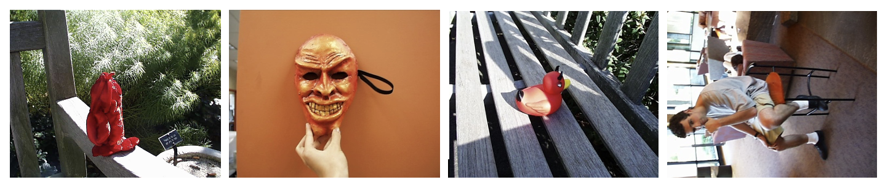
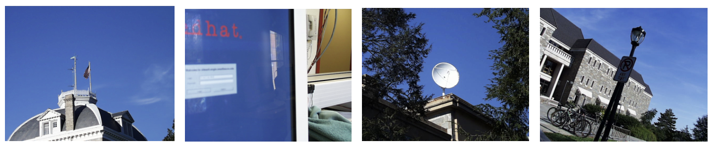
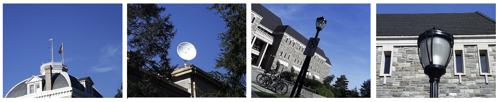
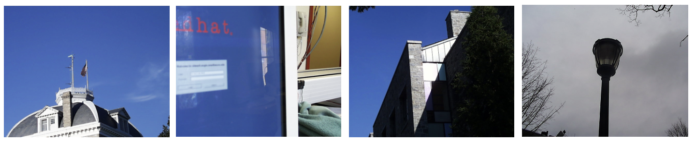
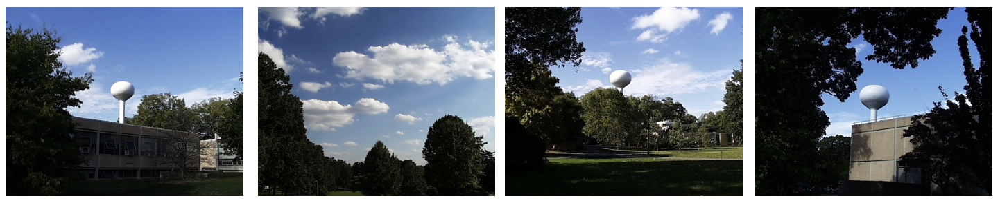
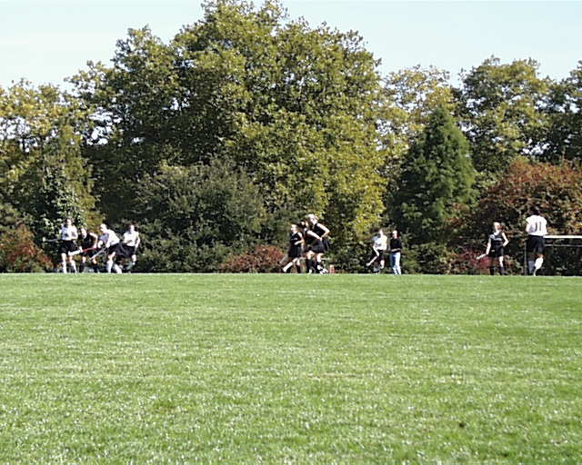
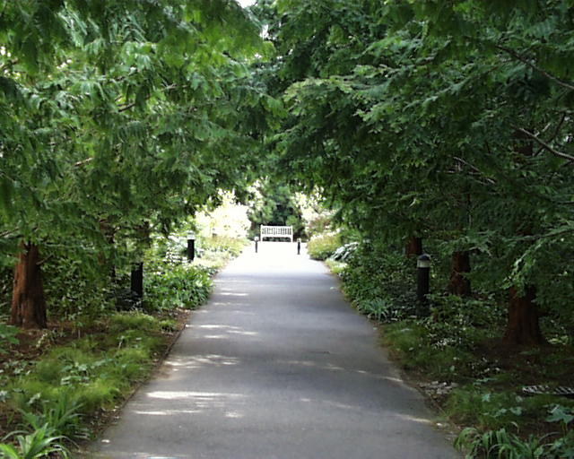
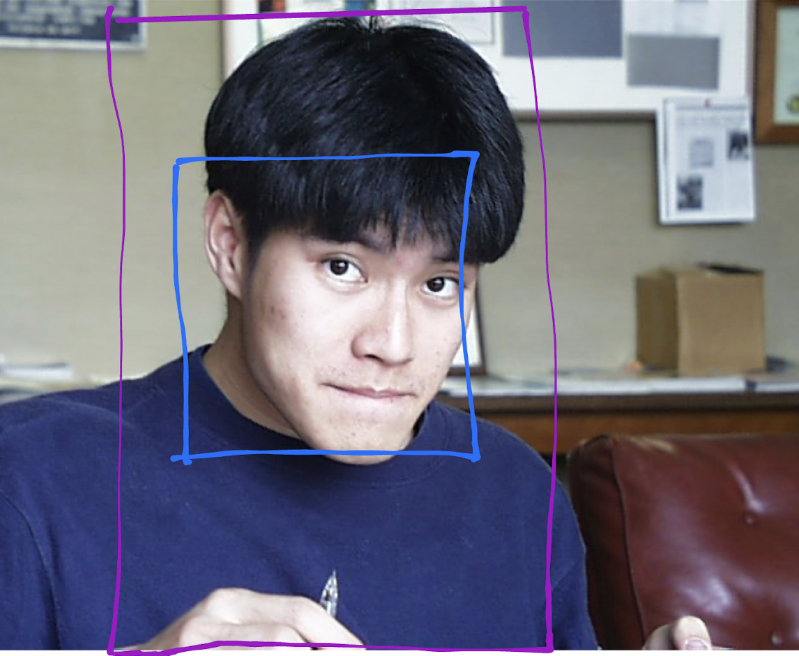

# Project 2: Content-based Image Retrieval
Author: Daniel Bi

CS5330 - Fall 2023
10/6/2023


Report link: https://github.com/danielyhbi/FALL23-CS5330/blob/main/project-2/project2.md

## Introduction
This package includes demostration of Content-Based Image Retrieval (CBIR) using the following methods: 
- Baseline Matching
- Histogram Matching
- Multi-histogram Matching
- Texture and Color
    - Histogram feature
    - Texture feature (Sobel)
- Custome Design
    - Find Grass/lawn
    - Fine Roads
- Facial/Human Recognition<sup>*</sup>
- GUI Features<sup>*</sup> (non CBIR)

\* represents the "extension" part of the assignment

Note: for each run, the feature vector for each image is computed fresh. The purpose is due to the narrower scope of the homework, and easier to debug for each image if needed. I understand this is not the most efficient way to cache in order to speed up the program.

### Baseline Matching
Per the assignment description, a single feature vector is constructed using the 9x9 square in the middle of the image. All channels (R, G, B) are used and each item on the vector represents an intensity of in a specific pixel. An example is below:
```c++
std::vector<float> baseline = [R in pixel 1, G in pixel 1, B in pixel 1,
                                R in pixel 2, G in pixel 2, ...];
```

after establishing a baseline, for each image in the file. A feature vector for each image is constructed and compared. Using sum-of-squared difference as the distance metric, the overall `difference`s are ranked. And the top 3 result is extracted.

Below on the most left is the original image. and the rest are ranked with similar images.



The result makes sense.. if you just look into the central 9 pixels (which is a tiny amount of area). So yeah, although it might not be overall sound, but the process is correct. Time to move on to more sophisticated methods.

### Histogram Matching

This slightly more sophisticated utilizes a histogram as the feature vector (the key, the fingerprint, the recipe, whatever you want to think of) when it comes to finding similar images. The process is more or less the same--comparing the histogram between the two images.

To determine the histogram, I used a 2D histogram that computes RG standard chromaticity, thus highlighting more on the red and green pixels. For the implementation, please see `histogram_matching.cpp`, within method `getHistogram`.

To calculate the distance metric, i used the hisrogram intersection where:
```c++
intersection += min(origVector, compareVector)
```

The results are shown below:



The matching results are quite good. The top 3 similar images all contain (mostly) a large portion of the blue sky and some white objects.

A histogram is an aggregated set of data that depicts the occurrence for each color (R/B/G). It tells us how many times has XXX occurred within a defined area, and that's it.. As we starting to notice, `histogram matching` does an excellent job of finding good matches when it comes to color, rather than the content placements.

For example, the #1 match (image 0080.jpg) is technically correct--it contains an appropriate amount of blue, a good amount of white, and a few colors in between.. However, it is not a sky NOR a building.

Let's explore the solution to this issue in the next section.

### Multi-Histogram Matching

Could having more histograms work in our favor? How about dividing the image into (4) parts (half length-wise/cross-wise). The result would be better since the algorithm is enforcing the correct color appearing in the correct location.

In the file `multiHistMatching.cpp`, I generated (4) feature vectors based on the (4) histogram that I created. The results are below:



The results were better, but not great.. Here is a table of the distance score for each run:

| Image Rank | Single Hisrogram | Multi Histogram |
|--|--|--|
| itself | 1.000 (0164.jpg) |1.000 (0164.jpg) |
| #1 | 0.417 (0080.jpg) |0.340 (0110.jpg)|
| #2 | 0.417 (0110.jpg) |0.241 (0426.jpg)|
| #3 | 0.382 (0426.jpg) |0.216 (0907.jpg)|

Especially for the second run (multi histogram), although the algorithm is looking at each corner for color matching, it is struggling to find a good match. The top match is only 0.340, which is not even 50% matching with the original.

Therefore, not only color is important. We also need to look into the shape of images--texture. For the purpose of this homework, we are looking into texture as edges transformed by `Sobel Edge Detection`. See the next section.

### Texture + Color

Hello Sobel Edge Detection (from the last homework). Trying to do better here since looking purely into colors is giving us sub-optimal results. 

For this section, I refactored my old codes, where the feature vector contains:
- one 2D histogram for the entire image
- one edge detection as a 2D histogram, with `row = magnitide`, and `col = direction of edges`

To generate a histogram for sobel edges, please see `multiHistTextureMatch.cpp` and under method `getSobelHistogram`. I divided up the intensity into 128 buckets, and polar coordinate into 180 buckets. Both halved, trying to save some computation time.

Per homework instruction, the scores for each feature vector are weighted equally.

Results are below. This time is shows the image match for `0164.jpg`.



The result is also not great. I see the scores getting higher (not sure what `0556.jpg` is doing here). I noticed the original image doesn't have that much of a defined edge (as a whole image) which contributes to why the texture is working less effectively.. However, I can see a big room for improvements if I divide up the image (similar to section 3), and do histogram + texture for (4) parts.

Let's try an image with a more defined texture (and uniform). Here are similar images for image `0274.jpg`.



The result is much better! (with a texture-heavy photo). Not only the sky and trees are correctly captured, you can also see the water towers are correctly identified. Pew, I thought my code was wrong!

What else can we do from now? Like I mentioned above, I would like to play around with
- locations/partial histogram
- different weights among feature vectors

See you in section 5.

### Custom Design

Per homework instruction, I picked 2 types of image for CBIR:
- Grass/Lawn
- Roads

The grass is heavy in texture, so I thought the edge detection would be benefitial. For roads, it is lacks texture so I'd like to prove myself I can make it work (unlike the failure I had in section 4 for `image 0535`).

The general process is as follows:
- Pick a few images that matches the image type (grass, roads)
- Refactor the Texture + Color code (in section 4)
    - Modify the histogram boundaries
    - Modify the weights
- Run the algorithm in the general set
- modify based on the results until I'm satisfied (or fed up with it)

#### Grass

Per homework instruction, I picked this image to represent the most "American Lawn". Although the sports aren't quite American..



|Histogram|Start Row| End Row | Start Col | End Col |
|-|-|-|-|-|
| Color | 0 | End | 0 | End |
| Texture | Half Way | End | 0 | End |

My thought process as follows:
- Grass/lawn is usually a natural photo, so lots of greens everywhere. Therefore the color histogram should capture the entire image
- We (humans) always take photos with grass on the bottom half of the image (quite common sense), so the grass texture should focus on the bottom half of the image.

After playing around with the weight. 50% color + 50% texture seems to be fine.
```c++
totalScore = 0.5 * colorInterections + 0.5 * textureInterections
```

The result was pretty good! Please excuse the index. Index #1 is the original image.

A good portion of the grass lawn images are captured, with some degradations at the end (with the bike park and other vegetation). All of the matches contained grass!


For detailed implementation, please refer to `custom1_grass.cpp`.

#### Roads

I picked this image to represent the most "road". No particular reasons, I just like this image.



|Histogram|Start Row| End Row | Start Col | End Col |
|-|-|-|-|-|
| Color | Half Way | End - 10 | 0 | End |
| Texture | Half Way | End - 10 | 10 | End |

My thought process as follows:
- Roadways are usually on the bottom of the image by common sense, so I'd like to just compare the texture within that area.
- Since roadways are usually on the bottom half, the top half can be anything--no need to capture and compare.
- To dial up the accuracy, I'm ignoring a few rows/cols on top and bottom of the image. Sometimes the edge detection would generate lines on the edge

I had more iterations with the weights this time. 30% color + 70% texture seems to be acceptable.
```c++
totalScore = 0.3 * colorInterections + 0.7 * textureInterections
```


The results are not as nice as the grassy one, simply because there are a million ways to take a photo of the roadways, but I'm overall pleased with the results. I simply gave up with the blurry bunny (rank #4 and sideway chair #7) with the limitations I had.

For detailed implementation, please refer to `custom3_roads.cpp`.

I decided to go further on the extension of my attempt to detect human/face.. it would be fun.

## Facial/Human Recognition

This is the end goal for a lot of CV applications, right?

* THIS IS THE EXTENSION FEATURE *

To get it to (half) working, I had to bring in a third histogram (on texture) that focus on the center-ish area of the image (since a person is usually the main subject of an image). See the figure below for the outline

|Histogram|Start Row| End Row | Start Col | End Col |
|-|-|-|-|-|
| Color | 10 | End - 10 | 25% | 60% |
| Texture | 10 | End - 10 | 25% | 60% |
| Texture (focus) | 25% | 66.7% | 33.3% | 50% |

Below is the sample image that I used to find similar. The purple box shows the boundary for the color and texture, and the blue box is showing the focus texture area.



The purpose of the focus texture histogram is to depict the texture of a human face (hopefully will be center-ish within the image). Rather than comparing to other images, the focus texture also compares itself to the larger texture histogram within the same image.

My thought is that this would eliminate objects that resemble human faces (in a smaller area), by comparing itself to the larger target area.

In addition to the score weights, I also deprioritized images that:
- has a larger difference between Texture and Texture (focus). 
- has colors that are vastly different than the original one.

```c++
    totalScore = 0.3 * color + 0.5 * scores[1] + 0.2 * scores[2];

    if (scores[0] < 0.2) {
        totalScore -= 0.1;
    }

    if (abs(scores[2] - scores[1]) > 0.1) {
        totalScore -=0.2;
    }
```

Below are the image results:


The results aren't... terrible. For the top 3 matches, you can tell it did exactly what I asked for--find similar within a defined area. However, the subsequent matches fell apart after the 5th one.

This is truly the best I can do within the time limit given, however, I'm sure the upcoming projects will fix this issue ;) 

### GUI and Other Extension Features (non CBIR)

In addition to the CBIR algorithm I developed. I also implemented other features that are helpful. For brevity, I will list them below and quickly explain if needed.

- GUI feature
    - Will display all the matching images after running the results. The ranks are labeled on the top left corner of the image.
    - So you don't have to look back in the command line and manually click on each image.
    - See the last bit in `findImages.cpp`
- OOD (Inheritance and Abstraction) feature
    - Each feature is inherited from `Feature`. It has a common `getFeatureVector()` and `compare()` method to be overridden.
    - This makes swapping between features very easy and efficient for testing purposes. If ever a full-scale GUI is written in the future, this will benefit greatly
- For better accuracy of the Sobel 2D histogram, implemented the orientation (in deg) to identify the direction of the edges.
    - See `combineSobelYXOrientation` and `getSobelHistogram` in `multiHistTextureMatch.cpp` for implementation.


### Reflections and References

I definitely learned so much on this project. I learned how a histogram works (finally) and the significance of histograms. If utilized correctly, it can efficiently be transformed into a feature for matching similar images.

I also learned the limitations of using histograms. It tells us the quantity, rather than preserving significant location data of the image. It is quite unfortunate that I ran out of time on this one.. I'm excited to see what future projects are like!

- openCv.org
- geeksforgeeks.org
- stackoverFlow.com
- https://medium.com/smucs/image-processing-algorithms-canny-edge-detector-58cd6e50477d


