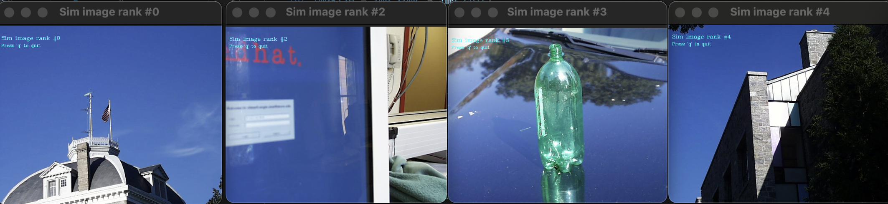
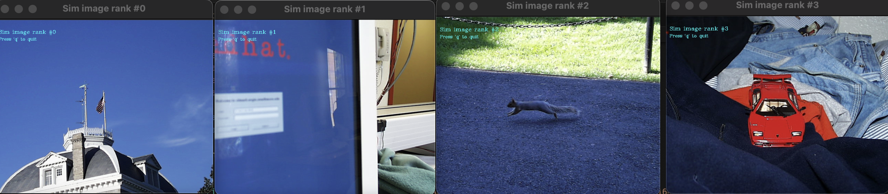
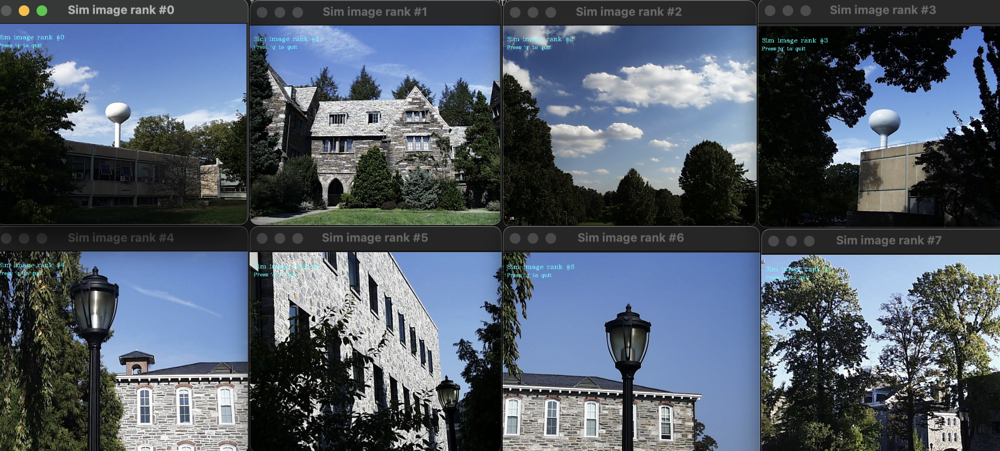
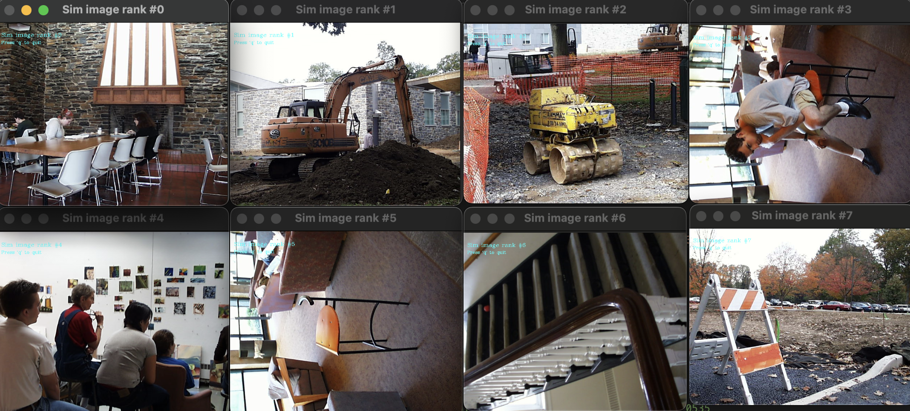
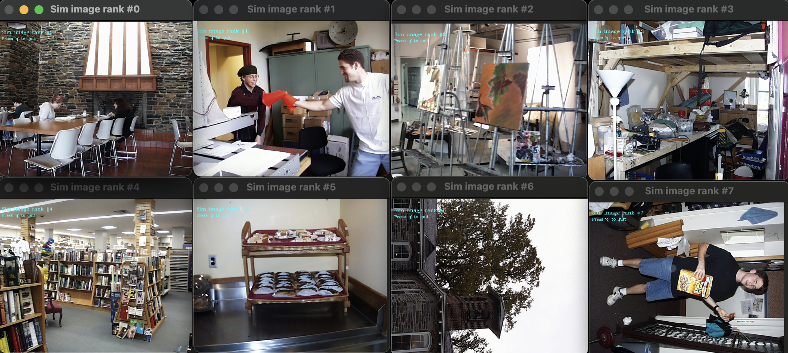

# Project 2: Content-based Image Retrieval - Amendment
Author: Daniel Bi

CS5330 - Fall 2023
12/8/2023

Repo link: https://github.com/danielyhbi/FALL23-CS5330/blob/main/project-2/

## Points Deductions and Modifications
- 0.5/1 for missing required items in report
  - See tasks below for more details
- 0/1 for comments and file headers
  - See tasks below for more details
- 3/4 for baseline matching
  - See tasks below for more details
- 4/6 for texture and color matching
  - See tasks below for more details
- 2/4 for custom matching
  - No Amendments
- 1/4 for extension
  - No Amendments

## Missing required items in report (0.5/1)
> I request +0.5 points for this section

Please see sections below--I believe I've added everything required. It includes:
- comments and file headers (should be just `feature.h` since other specific objects implements the abstract `Feature` class)
- 8 and 16 bin iamges from Task 2
- Comparsion for texture and feature matching
  
See below for task 2, with 1 histogram (8 bins) as feature vector.

See below for task 2, with 1 histogram (16 bins) as feature vector. Not too different from the first one.

See below for task 3, with 1 histogram (16 bins) as feature vector

## 0/1 for comments and file headers
> I request +1 point for this section

- Header for each file, as well as comments for major functions are added.
  
## 3/4 for baseline matching
> I request +1 point for this section

- Modified `BaselineMatching` module to correct a coding error that produces the wrong `rowPointer` which results inaccurate feature construction. (`baseline_matching.cpp`. line 27)
  

After fixing the `rowPointer` the sim images properly outputs images where the center is red, in accordance to the assignment example.

## 4/6 for texture and color matching
> I request +2 points for this section. 
> 
> I apoligize for not noticing the requred output is `pic.0535.jpg`. I focused on the "compare to images in task 2 and 3" so that I only used the image `pic.0274.jpg` and `pic.0164.jpg` from these tasks. I output 8 images to demonstrate my code completion.

Please see the required output below:
Sim images with 0535.jpg with 1 histogram only (16 bins). It is not as effective since we are only just getting features based on 1 whole histogram. The overall tone of the sim images are accurate (orange).

Sim images with 4 histogram (one on each corner). It does a better job on captureing the "chaotic" nature of the first image, but the overall texture is lacking.

Although it is similar to the previous result, you can notice the first match (row 1, image 2 from the left) actually capture the essense of the wall. You can also notice the busy patterns throughout the rest of the sim results.
