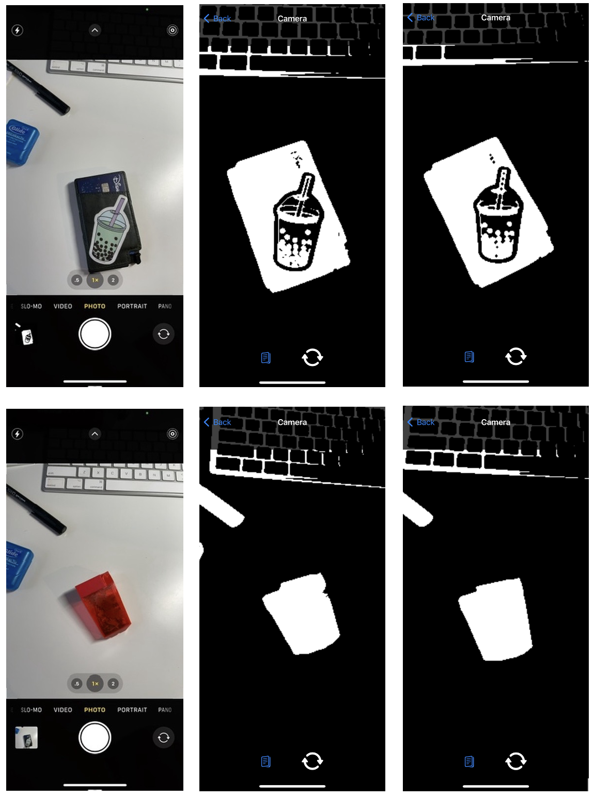
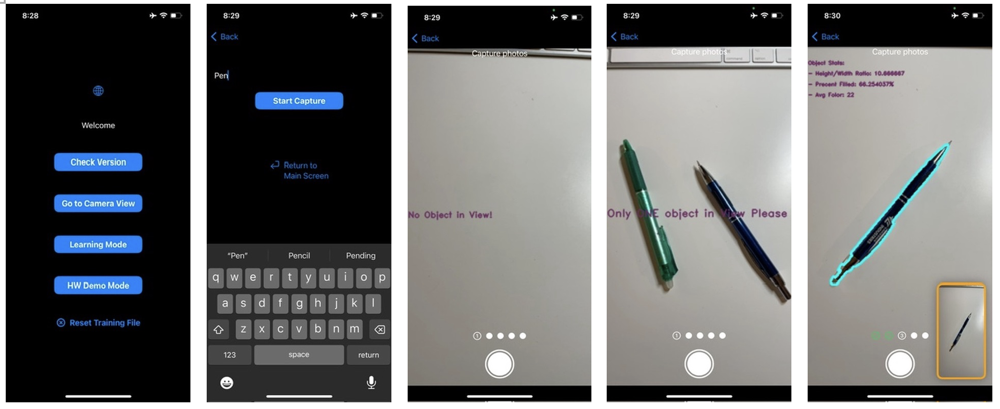
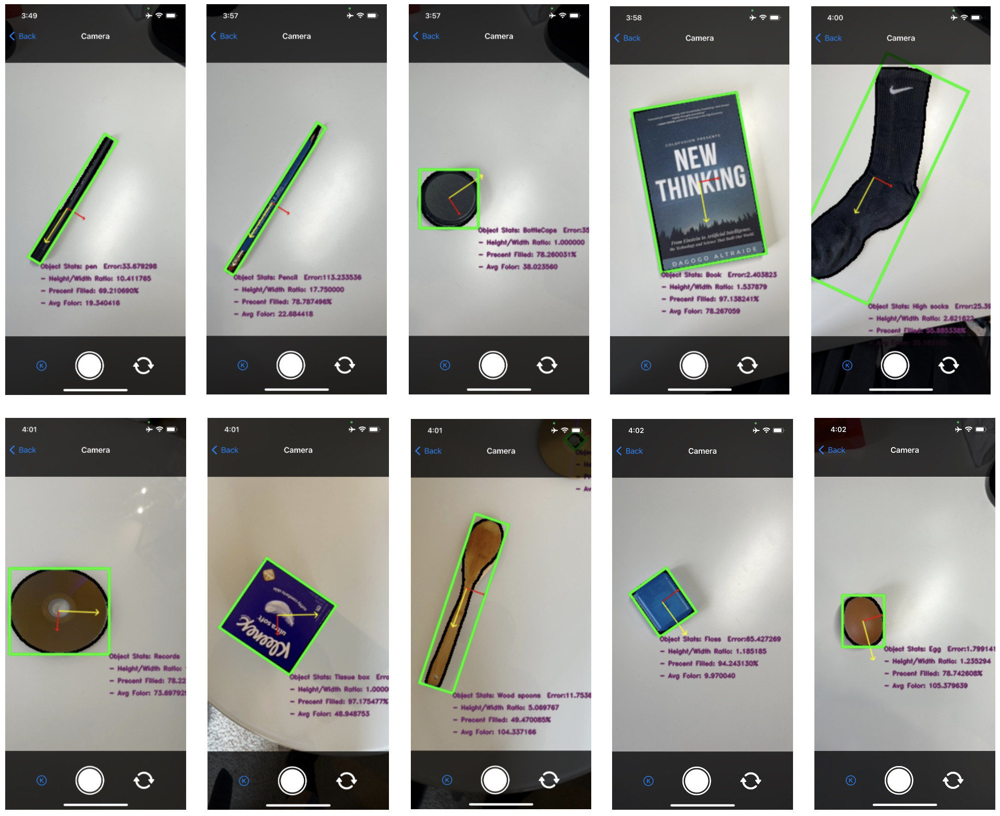

# Project 3: Real-time 2-D Object Recognition
Author: Daniel Bi

CS5330 - Fall 2023
10/23/2023

## Introduction
This package includes a demonstration of Real-time 2-D Object Recognition with the following tasks: 
1. Image Threshold to Binary Image (**self-written**) with k-means algo
2. Binary Clean-up with morphological filtering
3. Image Segmentation with Connected Components
4. Feature Computation
    - Height to Width Ratio
    - Filled Area Ratio
    - Average Color (in Greyscale)
5. Training Data Collections
6. Object Classifications
    - Euclidean Distance Metric
    - K-nearest Neighbour
7. Performace Evaluation with Confusion Matrix
8. Extensions

For the project extension, I decided to port openCV to SwiftUI. So the whole object recognition will happen in an iOS app. See more in the extension section.

Within the app, users can use the camera to recognize objects that are pre-trained. In addition, user can train their object of choice in the app. See the `Training Data Collections` section for further discussion.

Pre-trained objects are listed below:
>pen, pencil, bottle caps, book, high socks, records/CD, tissue box, wood spoons, floss, egg

Overall I had a lot of fun exploring object recognition in this project. It was quite challenging and time-consuming to write a functioning app in iOS with openCV since there's no direct library from openCV. Needless to say, I learned a lot about SwiftUI, objective-C, and openCV.

### Image Threshold to Binary Image
Per the assignment description, I need to write my code for one of the sections (from 1-4). I decided to write my algorithm for image thresholding.

For code inspection, please see `ObjectDetect/openCV/OpenCVWrapper.mm` and the section below:
```objectivec
+ (void) processThreshold: (cv::Mat &)image withBinaryMat:(cv::Mat &)binary
```

I followed the assignment description quite closely to dynamically set the threshold, sample from 25% of the random pixel with K=2. Below are the before/after examples. The top object is my wallet, and the bottom object is my pencil sharpener.

The first column is the original image (ish), and the second column is what it looks like after image thresholding.



### Binary Clean-up with morphological filtering

The third column from the photo above is the result of morphological filtering. The differences are subtle but noticeable.

I decided to use the `cv::MORPH_CLOSE` filtering (which is a dilation followed by erosion) since it is useful to get rid of small holes inside foreground objects and background. I figured i might get the spot effect due to my desk lights. 

Again here is the image (I have to post it again due to the assignment description): I purposely decided to show the boba sticker, as you can notice that the bobas and straws are indeed filtered from the `dilatation` and `erosion`.


### Image Segmentation with Connected Components

The assignment description is well-written, so there's no need for me to overexplain everything.

I utilized the `cv::connectedComponentsWithStats` for this task. The steps are as follows:
1. Run the function to get `labels` and `stats`
2. Mark the region area that is under `100`
3. Deep loop the `binary` Mat, using `labels` to get rid of the small region area and regions that connect with the image border
4. Re-color the remaining regions per assignment description

Here is the result below. Note that each region has a different color--even within my wallet, there are different regions within boba, which I thought was quite fun!


### Feature Computation

For features, I used a total of (3) below:
- Height to Width Ratio
- Filled Area Ratio
- Average Color (in Greyscale)

Since they are all either average or a ratio. All features are invariant to translation, scale, and rotation (in an ideal situation). I even rotated my wallet, and the axis rotated as I rotated on the screen. Note the yellow axis is the axis of the least central moment.

In addition, the oriented bounding box and feature stats are displayed in the bottom corner. And you can fit as many objects as you want in a frame (not overlapping).


### Training Data Collections

The design idea was deeply integrated with the **extension** project where the GUI is written in iOS. 

The process is a user will click a button on the main page `Learning Mode`. By following the instruction to enter an `object name`, the user can take max of 5 images of the object(s), and 5 additional entry is appended into the feature set, and subsequently updates the training model.

Below is a snapshot of the GUI. 

Note that the app will notify the user when there is no object OR multiple objects in view. A preview window on the bottom right corner shows the last photo taken by the user.



Once all (5) images are captured, openCV (objective-c) will process each image in place and send the additional info back to `DataModel` in swiftUI. Detail process follows:
1. SwiftUI's GUI and Camera take images (`LearningModeCaptureView`) and send them to openCV (objective-c)
2. openCV process images (`processBatchCaptures`) and send the feature back to Swift
3. SwiftUI updates the current feature list (`DataModel`), writes to the csv DB, and sends the updated feature list to openCV
4. openCV receives the new list and re-trains the model (`trainModel`)

A lot of back-and-forth passing creates inefficiencies. The reasons are below:
- ApplicationManager is in SwiftUI, and a training model is in openCV
- iOS app security (writing files)
- it's my first time writing a fully fledge app with Swift and Objective-C++

### Object Classifications

After sinking hours and hours into writing a GUI in the previous section. Learning new objects is quite easy to do now on the app.

For this section, the classifier is just the Euclidean distance metric. Three features from the detecting object are compared across all records in the existing database. No additional weights, just the pure equation, and math. The set with the least amount of Euclidean distance is the identified set.

For the additional classifier. The same feature sets are fed into a K-nearest neighbors model in openCV, fully utilizing the library `cv::ml::KNearest`.

>For extensions, an object will be labeled as unknows if the error exceeds 50 for Euclidean distance and 400 for K-Nearest Neighbour.

>In addition, any "error" exceeding a certain amount will be marked as low confidence (ie. Pen??). It is 20 for Euclidean and 200 for K-Nearest Neighbour.

Below are photos with all 10 objects, properly labeled and detected.




### Performace Evaluation with Confusion Matrix

Time to put my model to the test.. It is quite difficult to find 10 distinctly different objects in my apartment, and now it's time to find more objects..

See below the confusion matrix. Rows are the true labels, and columns are the classified labels.

|classify->|pen|pencil|bottle caps|book|high socks|records/CD|tissue box|wood spoons|floss|egg|
|-|-|-|-|-|-|-|-|-|-|-|
|pen|3|-|-|-|-|-|-|-|-|-|
|pencil|-|3|-|-|-|-|-|-|-|-|
|bottle caps|-|-|2|-|-|1|-|-|-|-|
|book|-|-|-|1|-|-|1|-|1|-|
|high socks|-|-|-|-|3|-|-|-|-|-|
|records/CD|-|-|-|-|-|3|-|-|-|-|
|tissue box|-|-|-|-|-|-|2|-|-|-|
|wood spoons|-|-|-|-|-|-|-|2|-|-|
|floss|-|-|-|-|-|-|-|-|2|-|
|egg|-|-|-|-|-|-|-|-|-|3|

> Both euclidean and kNN produced the same result. Therefore only 1 table is presented.

Overall, the model worked quite well. However, it has an issue in detecting objects with the same shape but a different size. Notably the model had low confidence in detecting book vs tissue box vs floss, and bottle caps vs CDs.

It is to be expected since all features are invariant in scale, rotation, and translation.

### Demo

Please see the video for the demo:
- Main detection demo
  - https://drive.google.com/file/d/1EyQQ2u5ijC6soUJnCDJDjzmAJ_1CS_iG/view?usp=sharing
- Learning mode demo
  - https://drive.google.com/file/d/1vFKElxHDmURe_PWR7N5urEOxUbrJvcKr/view?usp=sharing

## Extensions

### GUI (SwiftUI)

Rather than buying a webcam, I decided to write a mobile app to utilize the camera. I had some experience writing mobile applications but it was my first time writing a full app in Swift, not knowing openCV doesn't have a native library for the language..

Based on sage advice from the internet (see a very extensive list for references), the main structure of the app is as follows: 


> This is in no way a formal UML diagram. Just trying to get the point across. Please inspect the code if needed.

> Packages are managed with `CocoaPod`. install `OpenCV` before use in xcode. Use `ObjectDetect.xcodeproj` to edit and run the project.

### Other Extension Features

- GUI feature
  - Add as many objects (more than 10) as you can with the intuitive Learning Mode Process
  - User can reset the learning process on the main page
  - Use a different camera (can swape front/back facing camera) on any occasions
- Object Detection
  - Multiple object detection (as demoed in previous sections)
  - Unknown object and low confidence alert (question mark added at the end)
    - See `classifyWithEuclid` and `classifyWithKNN`
  - `cv::contours` are used to compute shape and physical property
  - Can switch between classifiers (Euclidean and KNN) by pressing the circle button. An indicator on the bottom left shows the user which classifier is current

### Limitations and Known Issues

- Limitation
  - All invariant features may lose fidelity when an object is defined by a scale (floss vs books)
  - Lighting and shading play a huge effect on the quality of object recognition
  The main image processing thread is single-threaded (in objective-c) which limits the computation power
- Known Issues
  - In learning more, taking photos too quickly may result in inaccurate feature output due to concurrency issues
  - UI not intuitive when the learning process is complete
  - User cannot view a list of trained objects

### References

> Not a comprehensive list, but it covers most of the websites that I've found helpful

- Object Detection Related Resources
  - https://docs.opencv.org/4.3.0/
  - https://pyimagesearch.com/2021/02/22/opencv-connected-component-labeling-and-analysis/
  - https://gist.github.com/yangcha/38f2fa630e223a8546f9b48ebbb3e61a
  - https://docs.opencv.org/3.4/de/d01/samples_2cpp_2connected_components_8cpp-example.html
  - https://stackoverflow.com/questions/14720722/binary-image-orientation
  - https://stats.stackexchange.com/questions/623322/understanding-relation-between-axis-of-least-and-maximum-second-moment
  - https://calcresource.com/moment-of-inertia-angle.html
  - https://en.wikipedia.org/wiki/Image_moment
  - https://docs.opencv.org/3.4/dd/d49/tutorial_py_contour_features.html
  - https://docs.opencv.org/3.4/df/d0d/tutorial_find_contours.html
  - https://docs.opencv.org/3.4/d0/daf/group__core__eigen.html
  - https://dsp.stackexchange.com/questions/4868/contour-and-area-raw-spatial-and-central-image-moments
- Integration (Swift+OpenCV) Related
  - https://medium.com/@hdpoorna/integrating-opencv-to-your-swift-ios-project-in-xcode-and-working-with-uiimages-4c614e62ac88
  - https://medium.com/pharos-production/using-opencv-in-a-swift-project-679868e1b798
  - https://stackoverflow.com/questions/30908593/using-opencv-in-swift-ios
  - https://medium.com/@me_6664/how-to-integrate-opencv-into-ios-project-3b40519244e8
- Swift/SwiftUI related
  - https://developer.apple.com/tutorials/sample-apps/capturingphotos-camerapreview
  - https://stackoverflow.com/questions/57028484/how-to-convert-an-image-to-uiimage
  - https://medium.com/@ranleung/uiimage-vs-ciimage-vs-cgimage-3db9d8b83d94
  - https://medium.com/@barbulescualex/making-a-custom-camera-in-ios-ea44e3087563
  - https://medium.com/onfido-tech/building-a-simple-lane-detection-ios-app-using-opencv-4f70d8a6e6bc
  - https://stackoverflow.com/questions/57269651/add-a-border-with-cornerradius-to-an-image-in-swiftui-xcode-beta-5
  - https://docs.opencv.org/4.x/d9/d61/tutorial_py_morphological_ops.html
- Objective C++ related
  - https://riptutorial.com/objective-c/example/3258/singleton-class
  - https://medium.com/@andy.nguyen.1993/singleton-pattern-in-ios-objective-c-and-swift-e33f0be1005
- CSV Related
  - geeksforgeeks.org
  - stackoverFlow.com