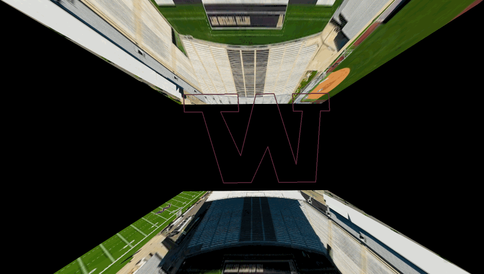

# Project 4: Calibration and Augmented Reality
Author: Daniel Bi

CS5330 - Fall 2023
11/05/2023

copy this link: (the one above does not work)
- https://github.com/danielyhbi/FALL23-CS5330/blob/main/project-4/project4.md

## Introduction
This package includes a demonstration of Calibration and Augmented Reality with the following tasks: 
1. Detect and Extract Chessboard Corners
2. Select Calibration Images
3. Calibrate the Camera
4. Calculate Current Position of the Camera
5. Project Outside Corners or 3D Axes
6. Create a Virtual Object
7. Detect Robust Features
8. Extensions

For the project extension, I decided impose a static image into the chessboard. My phone will display the chessboard.

The whole assignment revolves around openCV's external library. Using a base image that is trackable, less prome to translation and rotation degradation, a chessboard is used as base point tracking. Once the base points are tracked and calibrated, 3D points are re-projected on to a 2D surface (the board).

With points manupulation on the "2D surface", object(s) can be drawn and imposed on screen with real-time repositioning, hence achieveing the effect of augmented reality.

### Detect and Extract Chessboard Corners
(no required output specified)

### Select Calibration Images

The calibration process starts with highlighting all points in the frame.


Once calibrated, the code will project 4 corners. See the (4) red dots below.


### Calibrate the Camera

Once 5 images are captured, will start the calibration process and write out the instrinsic parameters. See the sample .yml file and output screenshot below. **Note the yml and output are from two different runs, showing the difference of calibration for each run.**

Overall, error was as the assignment predicted (below 1), about 0.0438 pixels.

```yml
%YAML:1.0
---
Camera_Matrix: !!opencv-matrix
   rows: 3
   cols: 3
   dt: d
   data: [ 1.3744842894904350e+03, 0., 9.4964601333028543e+02, 0.,
       1.3744842894904350e+03, 5.3961911204595049e+02, 0., 0., 1. ]
Distortion_Coefficients: !!opencv-matrix
   rows: 5
   cols: 1
   dt: d
   data: [ 6.4866947708854860e-03, 1.9248814115804996e-01,
       5.0525776966312246e-04, 5.5209688628759612e-04,
       -4.4525205013629393e-01 ]
```


### Calculate Current Position of the Camera

Sample output for the rotation/translation data is below:


### Project Outside Corners or 3D Axes

A few calibration images are included to demostrate it is working. Axis not included because it was an "alternative".


### Create a Virtual Object

Now I get to create a virtual object. Of course I created the logo from my favorite home college - University of Washington. 


### Detect Robust Features

I decided to use the harris corner detection within openCV. Below is the screenshots of it working. As you can tell, it is quite good at detecting corners or distrinct angular edges.

I imagine this would be quite useful on determining edges. However, it would be more complicated than `findChessboardCorners` because the point populates quite spraticly, which means I need to come up ways to keep track of fix points so I can project things on them reliabily.


### Extensions

**TL;DR--I imposed a static image of a football stadium on the chessboard.**

In order to celebrate the huge husky win against USC this weekend (Washington husky, the real husky, sorry not sorry ;). I decided to replace the chessboard image with the husky stadium (the greatest setting). The result was amazing, take me back to the Dawg Pack days..


While imposing, I accidentally messed up the coordinate, resulting a twisted image background. I thought this is even cooler, because it feels like the "W" is the football field, and top/down is the actual seats!



Go DAWGS.

I decided to stop here for extensions. Not only because I had limited time this week, but also both iOS/Android have excellent AR libraries. Maybe I will play around those another day.

### References

> Not a comprehensive list, but it covers most of the websites that I've found helpful

- https://docs.opencv.org/master/d4/d94/tutorial_camera_calibration.html
- docs about the required openCV methods