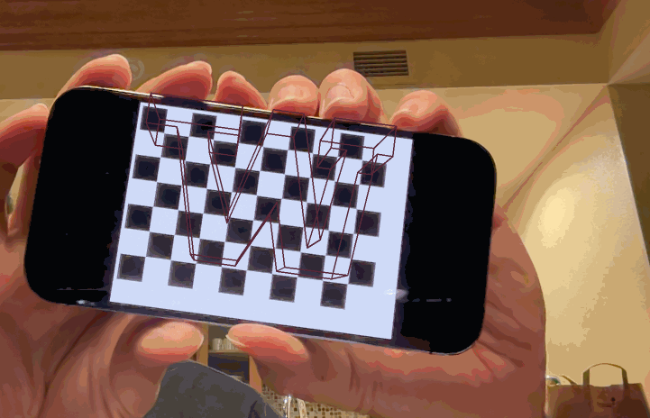
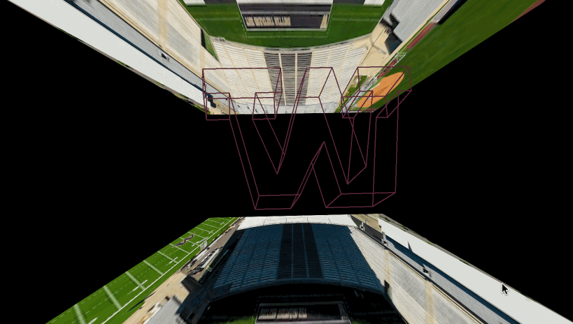

# Project 4: Calibration and Augmented Reality - Amendment
Author: Daniel Bi

CS5330 - Fall 2023
12/8/2023

Repo link: https://github.com/danielyhbi/FALL23-CS5330/blob/main/project-4/

## Points Deductions and Modifications
- 0.5/1 for reflection and acknowledgments
  - See revisions
- 2/5 for task 6
  - See revisions
- 2/4 for task 7
  - See revisions
- 3/4 for extensions 
  - No Amendments

## 0.5/1 for reflection and acknowledgments
> I request +0.5 points for this section

Under my original, the `acknowledgments` was listed as `references`, which is re-typed below:
```
  - https://docs.opencv.org/master/d4/d94/tutorial_camera_calibration.html
  - docs about the required openCV methods
```

If this is not as clear or sufficient enough, here are a few additional reources I looked at (mostly openCV related):
- https://www.geeksforgeeks.org/draw-a-line-using-opencv-in-c/
- https://docs.opencv.org/4.x/d4/d7d/tutorial_harris_detector.html
- https://docs.opencv.org/4.x/da/d54/group__imgproc__transform.html

## 2/5 for task 6
> I request +3 points for this section

```
Reason for 2/5 points:
  The system creates a rectangle using the 2D corners, but it should be making a virtual 3D object and using the camera parameters (extrinsic and intrinsic) to project it into the image.
```

I want to state that I've done the work for this part. 3D objects (lines and points of the purple W logo) were created based on 2D corners, points, and camera parameters. See `projectLinesToFrame(...)` in augmentedRealityDemo.cpp where it takes in the parameters for projections. See *simplified* code block below:

```cpp
int projectLinesToFrame(vector<Point3f> &points3D, cv::Scalar &color, Mat &frame, Mat &rots, Mat &trans, Mat &cam, Mat &distort)
{
    vector<Point2f> imagePoints2D;
    cv::projectPoints(points3D, rots, trans, cam, distort, imagePoints2D);

    # draw lines on the frame(mat)
    cv::line(...);
}
```

However, I totally understand the logo does not look "3D" since it was not properly presented as a gif and it only has (1) projected layer hovering above. I added a second layer which makes the "3D-ness" more apparent. Please see the gif below:



See below for the re-done extension (just want to show it since UW is 13-0 this year ;) )



## 2/4 for task 7
> I request +2 point for this section

```
Reason for 2/4 points:
 the program identifies feature points but the report does NOT discuss how they could be used as the basis for an AR system.
```

I apologize for failing to read the part where I have to explain why Harris Corner is helpful for the AR system. Please see a short narrative below--hope that is sufficient! I also included the GIF from the original report for illustration purposes.


>Similar to the concept of a chessboard matching, Harris Corner provides a good way for robust feature detection as shown in the gif in the report. Distinct points (in red dots) highlighted in gifs that represents features detected by the algorithm.
>
>To answer the question that I missed—due to the ability to detect good distinct feature points, those serve as good anchor points to overlay graphics and other information (similar to what I did with the chessboard). In addition, since there’s no need for a rigid chessboard, we can do spatial mapping to the environment, and feature mapping to detect existing mapped positions. Harris corner detection algorithm is quite an upgrade to a chessboard image and serves as the basics for AR.