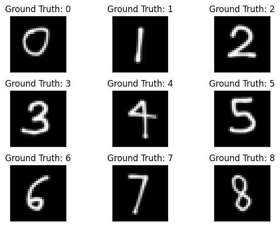

# Project 5: Recognition using Deep Networks
Author: Daniel Bi

CS5330 - Fall 2023
11/17/2023

copy this link: (the one above does not work)
- https://github.com/danielyhbi/FALL23-CS5330/blob/main/project-5/project5.md

## Introduction
This package includes a demonstration of using pytorch for image recognition using deep networks with the following tasks: 
1. Build and train a network to recognize digits
2. Examine your network
3. Transfer Learning on Greek Letters
4. Design your own experiment
5. Extensions

For the project extension, I decided to exame one more dimention. See section 4 below.

The whole assignment revolves around using pyTorch (the external library to build a functioning neural network). I followed the example and tutorial closely to complete this assignment. See links in the references section.

### 1. Build and train a network to recognize digits
#### A. Include a plot of the first six example digits in your report
> Note the data coming in are shuffled.


#### B. Build a network model
> Diagram plotted with Torchviz


#### C. Train the Model
> Train loss diagram with different colors


#### D. Train the Model
> N/A

#### E. Read the network and run it on the test set


#### F. Test the network on new inputs
> Just a plot to show my hand writing for the new inputs. They are resized and re-normalized as the database stat.

> Note my handwriting is quite different from the training set, which might affect the model prediction.



> The output below shows the prediction performance. The model has a bit trouble identifying my handwiritng (everyone's different)

```
Example 1 - Correct Label: 0, Predicted Label: 9, Probabilities: 0.98
Example 2 - Correct Label: 1, Predicted Label: 1, Probabilities: 0.99
Example 3 - Correct Label: 2, Predicted Label: 2, Probabilities: 1.00
Example 4 - Correct Label: 3, Predicted Label: 3, Probabilities: 1.00
Example 5 - Correct Label: 4, Predicted Label: 9, Probabilities: 0.76
Example 6 - Correct Label: 5, Predicted Label: 5, Probabilities: 0.98
Example 7 - Correct Label: 6, Predicted Label: 6, Probabilities: 0.95
Example 8 - Correct Label: 7, Predicted Label: 2, Probabilities: 0.35
Example 9 - Correct Label: 8, Predicted Label: 8, Probabilities: 0.99
Example 10 - Correct Label: 9, Predicted Label: 1, Probabilities: 0.36
```

Overall, the success rate is about 60%. Kind of make sense that it messes up 0 and 9, and 1 and 9. My handwriting is slender and somewhat unique as you can see above (I write 4 as closed on top, which looks like a 9).

### 2. Exam your network
#### A. Include a plot of the first six example digits in your report


some stats for my weight of the first layer is provided below:
```
Filter Weights Shape: torch.Size([10, 1, 5, 5])
Shape of X [N, C, H, W]: torch.Size([1000, 1, 28, 28])
Shape of y: torch.Size([1000]) torch.int64
```

#### B. Show the effect of the filters


As shown above, the result makes sense. On the image density graph (represented in purple), the darker color on the grid represents a lower intensive in the image. And as you can see on the applied filter on the right, the denser part represents a darker region within the image.

### 3. Transfer Learning on Greek Letters
#### A. Include a plot of the first six example digits in your report

> Below is the model stats printout
```
NeuralNetwork(
  (feature_maps_stack): Sequential(
    (0): Conv2d(1, 10, kernel_size=(5, 5), stride=(1, 1))
    (1): MaxPool2d(kernel_size=2, stride=2, padding=0, dilation=1, ceil_mode=False)
    (2): ReLU()
    (3): Conv2d(10, 20, kernel_size=(5, 5), stride=(1, 1))
    (4): Dropout2d(p=0.5, inplace=False)
    (5): MaxPool2d(kernel_size=2, stride=2, padding=0, dilation=1, ceil_mode=False)
    (6): ReLU()
  )
  (classify_stack): Sequential(
    (0): Flatten(start_dim=1, end_dim=-1)
    (1): Linear(in_features=320, out_features=50, bias=True)
    (2): ReLU()
    (3): Linear(in_features=50, out_features=3, bias=True)
  )
)
```

> Simplified diagram. Note the final output node has been changed to 3


> Traning Losses


> Validation result with my handwriting. got half of them right.. Note alpha = 0, beta = 1, gamma = 2
```
Example 1 - Correct Label: 0, Predicted Label: 2, Probabilities: 0.55
Example 2 - Correct Label: 0, Predicted Label: 0, Probabilities: 0.96
Example 3 - Correct Label: 2, Predicted Label: 2, Probabilities: 0.98
Example 4 - Correct Label: 2, Predicted Label: 2, Probabilities: 0.62
Example 5 - Correct Label: 1, Predicted Label: 2, Probabilities: 1.00
Example 6 - Correct Label: 1, Predicted Label: 2, Probabilities: 1.00
```

The result is not surprising.. I kind of get it, my handwriting is werid, and my `alpha` is basially a sideway `beta` (see the first and the second image below). See my handwritings below. This is interesting because it kind of shows you how the neural network is extracting the feature--maybe not as rotation invariant as we anticiptated.


### 4. Design your own experiment

For my own experiment, with the extension assignment in mind, I decided to explore (4) dimensions instead of (3) dimentions. They are listed below:

- Count of Convolution Layers = [1, 2, 3]
- Count of Convolution Depth (channel) per layer = [10, 20, 30]
- (2) dropout rate = [50%, 70%]
- Iterations (epochs) = [1, 2, ... , 20]

Since we spend lots of time discussion different neural networks, I'm curious on the effective on the Depth vs. Count of the Convolution network. Would more layers, or deeper network be more effective on improving the arrucracy of the network. 

For the experiemntation, I did a O(n^3) iteration of the network, and with each iteration, the network runs up to 20 epochs. See pseudocode below:

```python
for convoCount in [1, 2, 3]:
    for channelSice in [10, 20, 30]:
        for dropoutRate in [0.5, 0.7]:
            # run model with convoCount, channelSize, and dropoutRate
            # with epoch = 20

            # record result for each epoch
```

A snapshot of model with 1, 2 and 3 convolution network are shown below as examples of the neural network:
> Sample network with (1) convolution layer
```
NeuralNetwork(
  (feature_maps_stack): Sequential(
    (0): Conv2d(1, 10, kernel_size=(5, 5), stride=(1, 1))
    (1): ReLU()
  )
  (classify_stack): Sequential(
    (0): Flatten(start_dim=1, end_dim=-1)
    (1): Linear(in_features=5760, out_features=50, bias=True)
    (2): ReLU()
    (3): Linear(in_features=50, out_features=10, bias=True)
  )
)
```

> Sample network with (2) convolution layers
```
NeuralNetwork(
  (feature_maps_stack): Sequential(
    (0): Conv2d(1, 20, kernel_size=(5, 5), stride=(1, 1))
    (1): ReLU()
    (2): Conv2d(20, 40, kernel_size=(5, 5), stride=(1, 1))
    (3): Dropout2d(p=0.5, inplace=False)
    (4): MaxPool2d(kernel_size=2, stride=2, padding=0, dilation=1, ceil_mode=False)
    (5): ReLU()
  )
  (classify_stack): Sequential(
    (0): Flatten(start_dim=1, end_dim=-1)
    (1): Linear(in_features=4000, out_features=50, bias=True)
    (2): ReLU()
    (3): Linear(in_features=50, out_features=10, bias=True)
  )
)
```

> Sample network with (3) convolution layers
```
NeuralNetwork(
  (feature_maps_stack): Sequential(
    (0): Conv2d(1, 30, kernel_size=(5, 5), stride=(1, 1))
    (1): ReLU()
    (2): Conv2d(30, 60, kernel_size=(5, 5), stride=(1, 1))
    (3): Dropout2d(p=0.5, inplace=False)
    (4): MaxPool2d(kernel_size=2, stride=2, padding=0, dilation=1, ceil_mode=False)
    (5): ReLU()
    (6): Conv2d(60, 90, kernel_size=(5, 5), stride=(1, 1))
    (7): Dropout2d(p=0.5, inplace=False)
    (8): MaxPool2d(kernel_size=2, stride=2, padding=0, dilation=1, ceil_mode=False)
    (9): ReLU()
  )
  (classify_stack): Sequential(
    (0): Flatten(start_dim=1, end_dim=-1)
    (1): Linear(in_features=810, out_features=50, bias=True)
    (2): ReLU()
    (3): Linear(in_features=50, out_features=10, bias=True)
  )
)
```

All results are recorded and selective plots wil be provided below.

> The first figure dipicts run results in terms of accuracy, while showing the difference between convolution depth (`channelSize`) for a set of convolution layer counts.

 

 From the figure, it is clear that different dropout rates (in this case, 50% and 70%) are less significant than other factors. While there's less difference between one and two convolution layers, a large accuracy drop happened once the third layer is added. Therefore, too many convolution layers maybe an overkill in this experiment.


> The second figure is slightly different. Instead of the first figure, it shows the difference between number of convolution layers (`convoCount`) for a set of channel depths.

 

 The second figure explores the effectiveness on depth regards to each convolution layer. The plots first confirms the finding on the first plot--the effective dimimished once the third convolution is added. In addition, it shows there's less difference between depth of 10 and 20 per layer. 
 
 The result is quite clear that deeper depth is more effective than more layers. In figure 1, a single convolution layer with depth of 30 achieved the better accuracy rate compared to (3) layers with depth of 30. Same thing on figure 2, single or 2 `convoCounts` (in blue and orange) performs better in accuracy rate compare to 3 layers (in green).
 
 With additional benefit of shorter runtimes, a greater depth per layer is more effective than more convoltion layers with shallower depth. 

### Extensions

As I've just explained above, the extension of the homework is to add in (1) additional dimention for me to analyze on the best way to create a neural network.

### References

> Not a comprehensive list, but it covers most of the websites that I've found helpful

- https://towardsdatascience.com/custom-dataset-in-pytorch-part-1-images-2df3152895
- https://matplotlib.org/stable/users/explain/colors/colormaps.html
- https://stackoverflow.com/questions/12201577/how-can-i-convert-an-rgb-image-into-grayscale-in-python
- https://stackoverflow.com/questions/12201577/how-can-i-convert-an-rgb-image-into-grayscale-in-python
- https://pytorch.org/tutorials/beginner/basics/quickstart_tutorial.html
- https://nextjournal.com/gkoehler/pytorch-mnist
- https://appsilon.com/visualize-pytorch-neural-networks/#torchviz